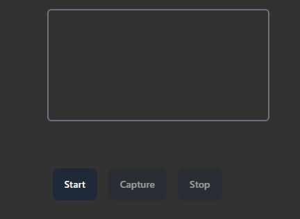
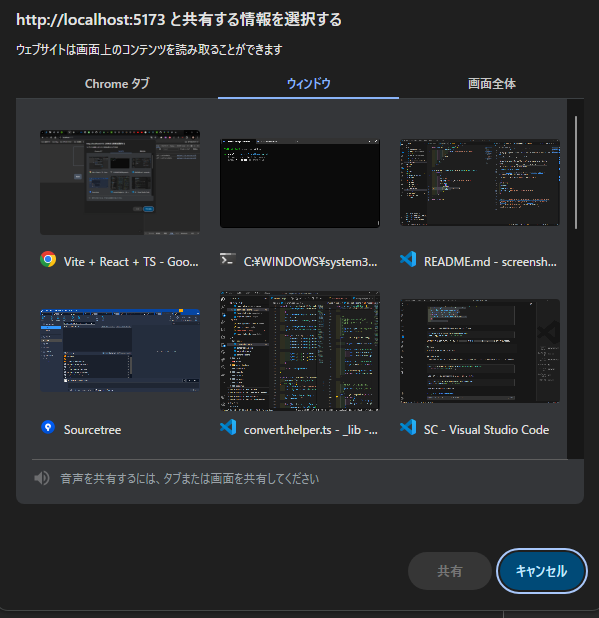
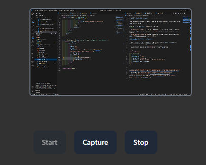
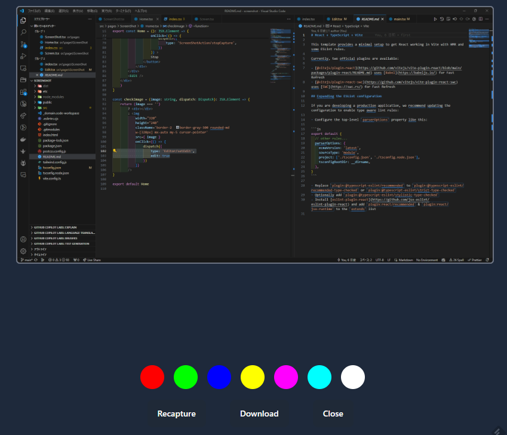
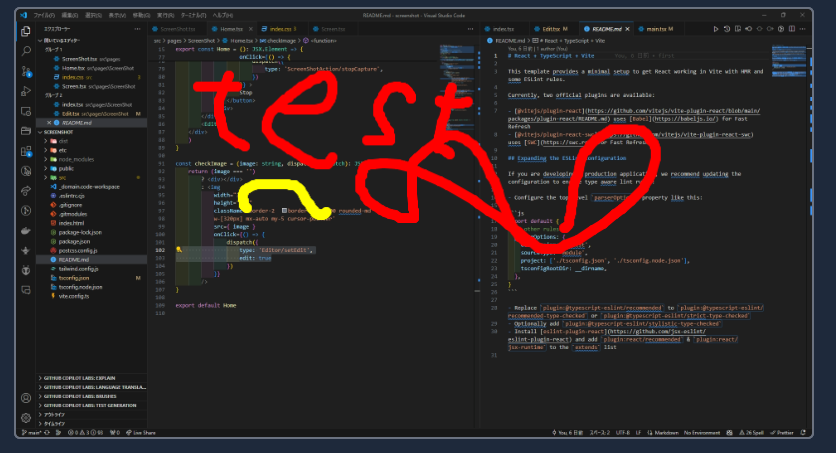
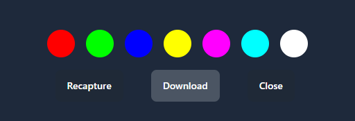

# スクリーンショット撮影

便利なツールがたくさんあるので
あくまで技術検証を目的にしたツール
DisplayMediaから画面の内容をキャプチャし
簡単な落書きを行う

# 実行サンプル
[サンプル](https://screenshot-e92.pages.dev/)

キャプチャ開始後

キャプチャ対象の選択選択画面から
タブ・ウインドゥ・画面を選択

「Capture」ボタンでキャプチャ

適時画面に色を付け

「Download」を行う
「Recapture」実行時はペイント内容が初期化される
